# Jarkom-Modul-5-D16-2023

**Praktikum Jaringan Komputer Modul 4 Tahun 2023**

## Author

| Nama                     | NRP        |
| ------------------------ | ---------- |
| Dicky Indra Kuncahyo     | 5025201250 |
| Widian Sasi Disertasiani | 5025211024 |

# Laporan Resmi

## Topologi


## IP


## CONFIGURASI

### Aura

```C
auto eth0
iface eth0 inet dhcp

auto eth1
iface eth1 inet static
	address 192.199.0.21
	netmask 255.255.255.252

auto eth2
iface eth2 inet static
	address 192.199.0.17
	netmask 255.255.255.252

### Heiter
auto eth0
iface eth0 inet static
	address 192.199.0.22
	netmask 255.255.255.252

auto eth1
iface eth1 inet static
	address 192.199.8.1
	netmask 255.255.248.0

auto eth2
iface eth2 inet static
	address 192.199.4.1
	netmask 255.255.252.0
```

### Frieren

```C
auto eth0
iface eth0 inet static
	address 192.199.0.18
	netmask 255.255.255.252

auto eth1
iface eth1 inet static
	address 192.199.0.13
	netmask 255.255.255.252

auto eth2
iface eth2 inet static
	address 192.199.0.9
	netmask 255.255.255.252
```

### Himmel

```C
auto eth0
iface eth0 inet static
	address 192.199.0.10
	netmask 255.255.255.252

auto eth1
iface eth1 inet static
	address 192.199.2.1
	netmask 255.255.254.0

auto eth2
iface eth2 inet static
	address 192.199.0.129
	netmask 255.255.255.128
```

### Fern

```C
auto eth0
iface eth0 inet static
	address 192.199.0.130
	netmask 255.255.255.128

auto eth1
iface eth1 inet static
	address 192.199.0.5
	netmask 255.255.255.252

auto eth2
iface eth2 inet static
	address 192.199.0.1
	netmask 255.255.255.252
```

### Sein (Web Server)

```C
auto eth0
iface eth0 inet static
	address 192.199.4.2
	netmask 255.255.252.0
gateway 192.199.4.1
```

### Stark (Web Server)

```C
auto eth0
iface eth0 inet static
	address 192.199.0.14
	netmask 255.255.255.252
	gateway 192.199.0.13

Richter (DNS Server)
auto eth0
iface eth0 inet static
	address 192.199.0.6
	netmask 255.255.255.252
	gateway 192.199.0.5
```

### Revolte (DHCP Server)

```C
auto eth0
iface eth0 inet static
	address 192.199.0.2
	netmask 255.255.255.252
	gateway 192.199.0.1
```

### All Client

```C
auto eth0
iface eth0 inet dhcp
```

### ROUTING

Aura

```C
#Kanan
route add -net 192.199.8.0 netmask 255.255.248.0 gw 192.199.0.22 #A9
route add -net 192.199.4.0 netmask 255.255.252.0 gw 192.199.0.22 #A10

#Bawah
route add -net 192.199.0.0 netmask 255.255.255.252 gw 192.199.0.18 #A1
route add -net 192.199.0.4 netmask 255.255.255.252 gw 192.199.0.18 #A2
route add -net 192.199.0.128 netmask 255.255.255.128 gw 192.199.0.18 #A3
route add -net 192.199.2.0 netmask 255.255.254.0 gw 192.199.0.18 #A4
route add -net 192.199.0.8 netmask 255.255.255.252 gw 192.199.0.18 #A5
route add -net 192.199.0.12 netmask 255.255.255.252 gw 192.199.0.18 #A6
```

Heiter (DHCP Relay)

```c
echo nameserver 192.168.122.1 > /etc/resolv.conf
route add -net 0.0.0.0 netmask 0.0.0.0 gw 192.199.0.21 #default

DHCP Relay
apt-get update
apt-get install isc-dhcp-relay -y
service isc-dhcp-relay start

echo '
SERVERS="192.199.0.2"
INTERFACES="eth1 eth2"
OPTIONS=' > /etc/default/isc-dhcp-relay

echo '
net.ipv4.ip_forward=1' > /etc/sysctl.conf

service isc-dhcp-relay restart

```

Frieren

```c
echo nameserver 192.168.122.1 > /etc/resolv.conf

route add -net 0.0.0.0 netmask 0.0.0.0 gw 192.199.0.17 #default
route add -net 192.199.0.0 netmask 255.255.255.252 gw 192.199.0.10 #A1
route add -net 192.199.0.4 netmask 255.255.255.252 gw 192.199.0.10 #A2
route add -net 192.199.0.128 netmask 255.255.255.128 gw 192.199.0.10 #A3
route add -net 192.199.2.0 netmask 255.255.254.0 gw 192.199.0.10 #A4
```

Himmel

```c
echo nameserver 192.168.122.1 > /etc/resolv.conf

route add -net 0.0.0.0 netmask 0.0.0.0 gw 192.199.0.9 #default
route add -net 192.199.0.0 netmask 255.255.255.252 gw 192.199.0.130 #A1
route add -net 192.199.0.4 netmask 255.255.255.252 gw 192.199.0.130 #A2

DHCP Relay
apt-get update
apt-get install isc-dhcp-relay -y
service isc-dhcp-relay start

echo '
SERVERS="192.199.0.2"
INTERFACES="eth1 eth2"
OPTIONS=' > /etc/default/isc-dhcp-relay

echo '
net.ipv4.ip_forward=1' > /etc/sysctl.conf
service isc-dhcp-relay restart

Revolte (DHCP Server)
echo nameserver 192.168.122.1 > /etc/resolv.conf

apt-get update
apt-get install isc-dhcp-server -y
dhcpd --version

echo 'INTERFACES="eth0"' > /etc/default/isc-dhcp-server

echo '
subnet 192.199.0.0 netmask 255.255.255.252 {

}

# SchwerMountain

subnet 192.199.0.128 netmask 255.255.255.128 {
range 192.199.0.130 192.199.0.193;
option routers 192.199.0.129;
option broadcast-address 192.199.0.255;
option domain-name-servers 192.199.0.6;
default-lease-time 600;
max-lease-time 7200;
}

# LaubHills

subnet 192.199.2.0 netmask 255.255.254.0 {
range 192.199.2.2 192.199.3.1;
option routers 192.199.2.1;
option broadcast-address 192.199.3.255;
option domain-name-servers 192.199.0.6;
default-lease-time 600;
max-lease-time 7200;
}

# TurkRegion

subnet 192.199.8.0 netmask 255.255.248.0 {
range 192.199.8.2 192.199.11.255;
option routers 192.199.8.1;
option broadcast-address 192.199.15.255;
option domain-name-servers 192.199.0.6;
default-lease-time 600;
max-lease-time 7200;
}

# GrobeForest

subnet 192.199.4.0 netmask 255.255.252.0 {
range 192.199.4.2 192.199.6.1;
option routers 192.199.4.1;
option broadcast-address 192.199.7.255;
option domain-name-servers 192.199.0.6;
default-lease-time 600;
max-lease-time 7200;
}' > /etc/dhcp/dhcpd.conf

service isc-dhcp-server restart

apt-get install isc-dhcp-server -y
dhcpd --version

echo 'INTERFACES="eth0"' > /etc/default/isc-dhcp-server

echo '

# A10

subnet 10.40.0.20 netmask 255.255.255.252 {
}

# A9

subnet 10.40.0.16 netmask 255.255.255.252 {
}

# SchwerMountain (A8)

subnet 10.40.0.128 netmask 255.255.255.128 {
range 10.40.0.130 10.40.0.193;
option routers 10.40.0.129;
option broadcast-address 10.40.0.255;
option domain-name-servers 10.40.0.18;
default-lease-time 600;
max-lease-time 7200;
}

# LaubHills (A7)

subnet 10.40.2.0 netmask 255.255.254.0 {
range 10.40.2.2 10.40.3.1;
option routers 10.40.2.1;
option broadcast-address 10.40.3.255;
option domain-name-servers 10.40.0.18;
default-lease-time 600;
max-lease-time 7200;
}
```

Fern

```c
echo nameserver 192.168.122.1 > /etc/resolv.conf
route add -net 0.0.0.0 netmask 0.0.0.0 gw 192.199.0.129 #default
```

# SOAL

Nomor 1

Aura

```c
IPETH0="$(ip -br a | grep eth0 | awk '{print $NF}' | cut -d'/' -f1)"
iptables -t nat -A POSTROUTING -o eth0 -j SNAT -s 192.199.0.0/20 --to-source "$IPETH0" 
```

Nomor 2

Kalian diminta untuk melakukan drop semua TCP dan UDP kecuali port 8080 pada TCP.

```c
LaubHills
iptables -F
iptables -A INPUT -p tcp --dport 8080 -j ACCEPT
iptables -A INPUT -p tcp -j DROP
iptables -A INPUT -p udp -j DROP

Testing
Install apt-get install netcat -y
LaubHills
nc -l -p 8080

SchwerMountain
nc [IP LaubHills] 8080
nc 192.199.2.3 8080
```

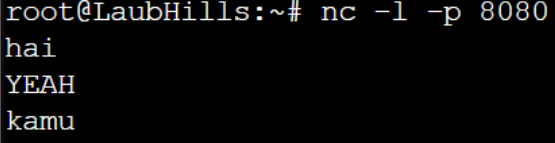
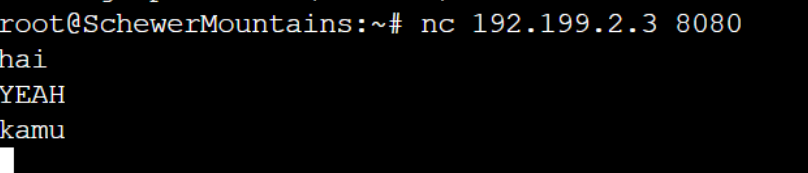

Nomor 3

Kepala Suku North Area meminta kalian untuk membatasi DHCP dan DNS Server hanya dapat dilakukan ping oleh maksimal 3 device secara bersamaan, selebihnya akan di drop.

```c
Revolte (DHCP Server) & Richter (DNS Server)
iptables -A INPUT -m state --state ESTABLISHED,RELATED -j ACCEPT
iptables -A INPUT -p icmp -m connlimit --connlimit-above 3 --connlimit-mask 0 -j DROP
Testing
Ping Revolte dan Richter
```

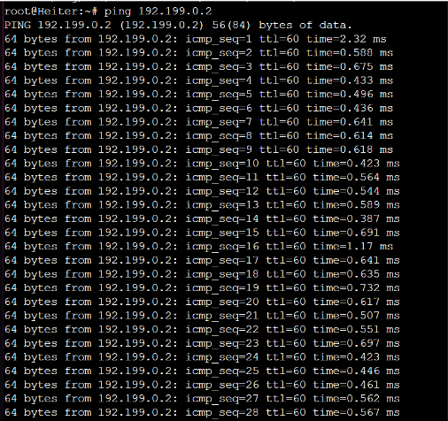
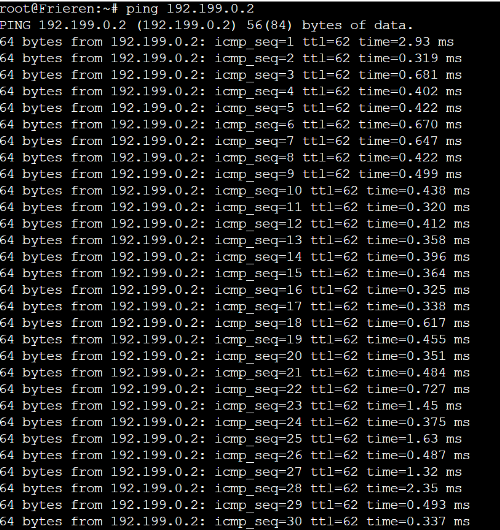
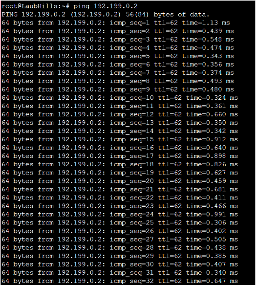
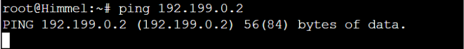
Nomor 4

Lakukan pembatasan sehingga koneksi SSH pada Web Server hanya dapat dilakukan oleh masyarakat yang berada pada GrobeForest.

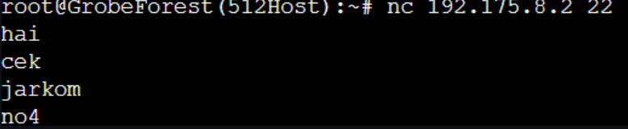
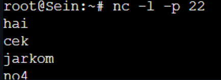

```c
Sein dan Stark (Web Server)
iptables -A INPUT -p tcp --dport 22 ! -s [IP GrobeForest] -j REJECT
```

Nomor 5

Selain itu, akses menuju WebServer hanya diperbolehkan saat jam kerja yaitu Senin-Jumat pada pukul 08.00-16.00.

```c
Sein dan Stark (Web Server)
iptables -A INPUT -m time --timestart 08:00 --timestop 16:00 --weekdays Mon,Tue,Wed,Thu,Fri -j ACCEPT
iptables -A INPUT -j REJECT
```

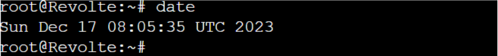
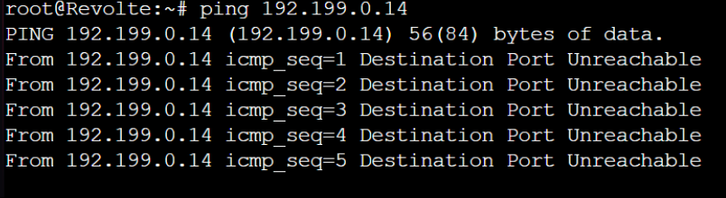

Nomor 6

Lalu, karena ternyata terdapat beberapa waktu di mana network administrator dari WebServer tidak bisa stand by, sehingga perlu ditambahkan rule bahwa akses pada hari Senin - Kamis pada jam 12.00 - 13.00 dilarang (istirahat maksi cuy) dan akses di hari Jumat pada jam 11.00 - 13.00 juga dilarang (maklum, Jumatan rek).

```c
Sein dan Stark (Web Server)
iptables -I INPUT 1 -m time --timestart 12:00 --timestop 13:00 --weekdays Mon,Tue,Wed,Thu -j REJECT
iptables -I INPUT 1 -m time --timestart 11:00 --timestop 13:00 --weekdays Fri -j REJECT
```

Nomor 7

Karena terdapat 2 WebServer, kalian diminta agar setiap client yang mengakses Sein dengan Port 80 akan didistribusikan secara bergantian pada Sein dan Stark secara berurutan dan request dari client yang mengakses Stark dengan port 443 akan didistribusikan secara bergantian pada Sein dan Stark secara berurutan.

Nomor 8

Karena berbeda koalisi politik, maka subnet dengan masyarakat yang berada pada Revolte dilarang keras mengakses WebServer hingga masa pencoblosan pemilu kepala suku 2024 berakhir. Masa pemilu (hingga pemungutan dan penghitungan suara selesai) kepala suku bersamaan dengan masa pemilu Presiden dan Wakil Presiden Indonesia 2024.

```c
Sein dan Stark (Web Server)
iptables -A INPUT -s 192.199.0.0/30 -m time --datestart 2024-02-14 --datestop 2024-06-26 -j REJECT
```

Nomor 9

Sadar akan adanya potensial saling serang antar kubu politik, maka WebServer harus dapat secara otomatis memblokir alamat IP yang melakukan scanning port dalam jumlah banyak (maksimal 20 scan port) di dalam selang waktu 10 menit.
(clue: test dengan nmap)

```c
Sein dan Stark (Web Server)
iptables -N portcheck
iptables -A INPUT -m recent --name portcheck --update --seconds 600 --hitcount 20 -j DROP
iptables -A FORWARD -m recent --name portcheck --update --seconds 600 --hitcount 20 -j DROP
iptables -A INPUT -m recent --name portcheck --set -j ACCEPT
iptables -A FORWARD -m recent --name portcheck --set -j ACCEPT
```

Nomor 10
Karena kepala suku ingin tau paket apa saja yang di-drop, maka di setiap node server dan router ditambahkan logging paket yang di-drop dengan standard syslog level.

```c
iptables -A INPUT  -j LOG --log-level debug --log-prefix 'Dropped Packet' -m limit --limit 1/second --limit-burst 10
```

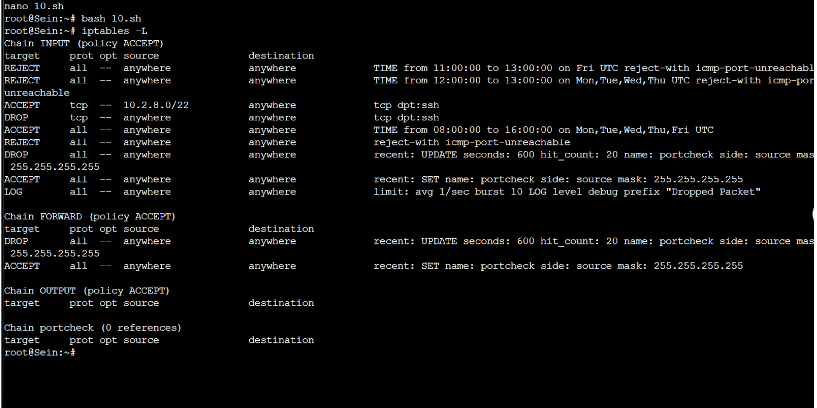
